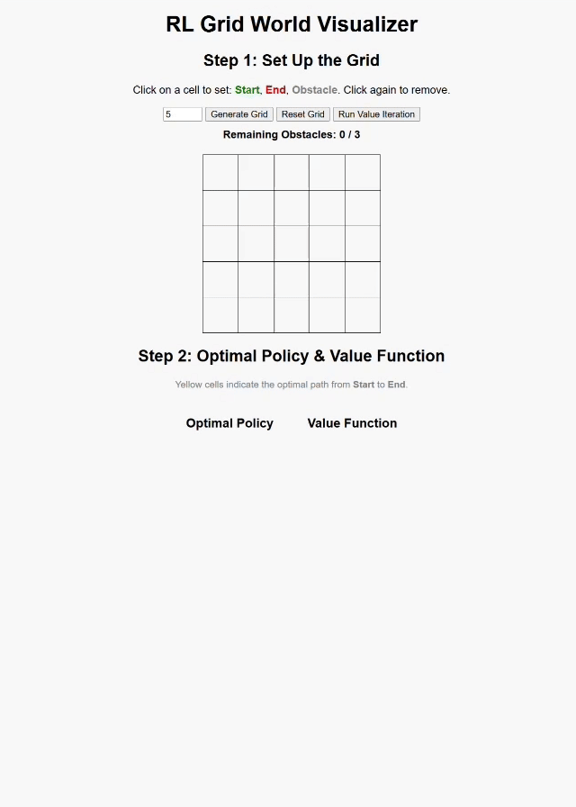

# HW1: Gridworld Environment and Value Iteration  
## **目錄架構** 
```bash
grid-map-flask-app/
├── app.py                # Flask 主程式
│
├── static/               # 靜態檔案 (CSS, JS, 圖片等)
│   ├── style.css         # 自訂 CSS 樣式
│   └── script.js         # JavaScript 控制互動邏輯
│
├── templates/            # HTML 模板
│   └── index.html        # 主畫面 (表單 + 動態網格)
│
└── README.md             
```
## 系統需求 
- Python 3.8 以上版本
- Flask 套件  

## 執行方式 
```bash
python app.py
```
```cpp
http://127.0.0.1:5000/
```

## 方格數量 (Grid Size)

   - 預設為 **5x5**，可調整範圍 **5 至 9**。
   - 請先調整數字再按 "Generate Square" 生成新方格。
   - 每次重新產生方格時，會自動清空所有設定（起點、終點、障礙物）。

## 格子設定 (起點、終點、障礙物) 

   - 起點 (綠色)、終點 (紅色)、障礙物 (灰色) 都用點擊格子來設定。
   - 只能有一個起點與終點，障礙物最多 (n-2) 個，超過會提示。
   - 點擊已設定的格子可取消該格設定。
   - 點擊順序建議為：起點 → 終點 → 障礙物。
  
## 按鈕功能

   - `Generate Square`：依輸入數字產生 n x n 格子，並清空原設定。
   - `Reset Grid`：清空所有格子設定，回到空白狀態。
   - `Next to HW1-2`：當起點和終點都設定完成時，產生策略與價值矩陣，若未完成會跳提示。   
  
## 障礙提示

   - 下方會顯示剩餘可放置的障礙數量，如 "Remaining Obstacles: 2 / 3"。
   - 隨障礙新增與移除動態更新。

## 成果範例
  


## 操作影片
 